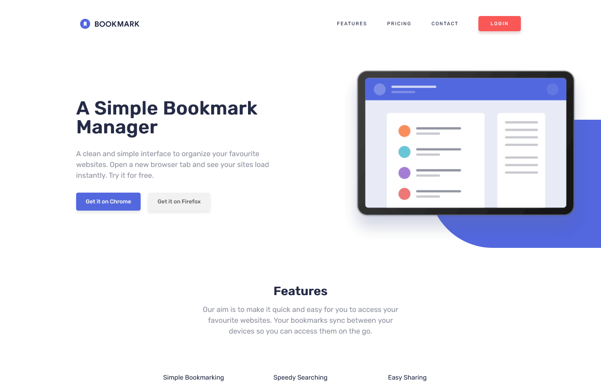
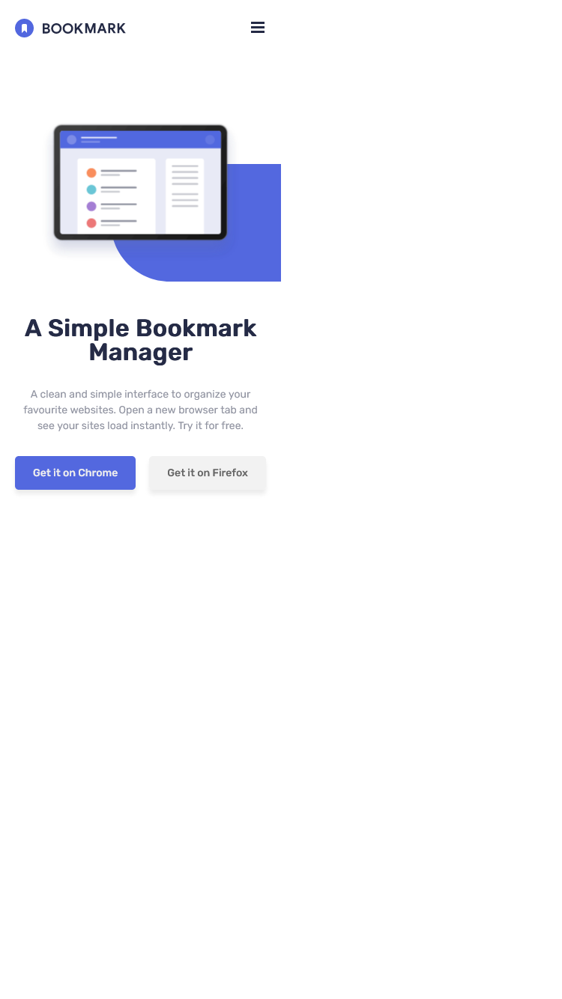

# Frontend Mentor - Bookmark landing page solution

This is a solution to the [Bookmark landing page challenge on Frontend Mentor](https://www.frontendmentor.io/challenges/bookmark-landing-page-5d0b588a9edda32581d29158). Frontend Mentor challenges help you improve your coding skills by building realistic projects.

## Table of contents

-   [Overview](#overview)
    -   [The challenge](#the-challenge)
    -   [Screenshot](#screenshot)
    -   [Links](#links)
-   [My process](#my-process)
    -   [Built with](#built-with)
    -   [What I learned](#what-i-learned)
    -   [Useful resources](#useful-resources)

## Overview

### The challenge

### Screenshot




### Links

-   Live Site URL: [Netlify](https://comfy-brioche-75eec4.netlify.app/)

## My process

### Built with

-   Semantic HTML5 markup
-   CSS custom properties
-   Flexbox
-   CSS Grid
-   Mobile-first workflow
-   JavaScript

### What I learned

Some of the things I learnt doing this project include using the html details element.

```html
<details class="FAQ-box">
    <summary class="FAQ-question">
        <span class="FAQ-question-text"
            >What about other Chromium browsers?</span
        >
        
    </summary>
    <p class="FAQ-answer-text">
        Lorem ipsum dolor sit amet, consectetur adipiscing elit. Fusce tincidunt
        justo eget ultricies fringilla. Phasellus blandit ipsum quis quam ornare
        mattis.
    </p>
</details>
```

### Useful resources

-   [Box Shadow CSS Generator](cssgenerator.org/box-shadow-css-generator.html) - This website helped create shadow boxes easily.
